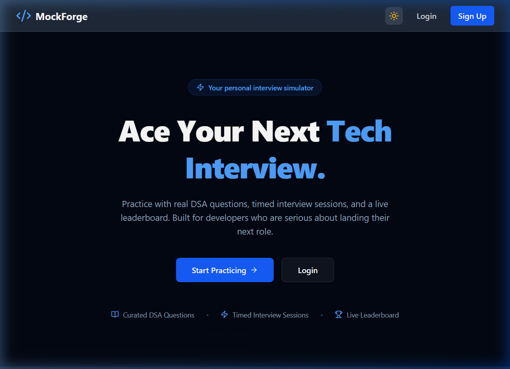
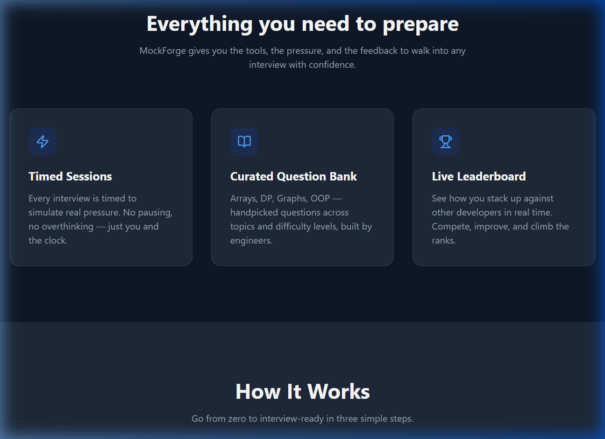
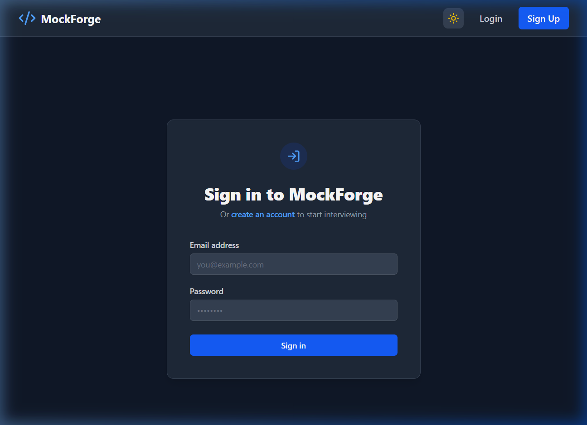

<p align="center">
  
  
  
  
</p>

# ⚒️ MockForge — Interview Simulator

> A full-stack MERN application that simulates timed technical interviews with curated DSA questions, real-time scoring, a global leaderboard, and an AI-powered coach review.



## ✨ Features

| Feature | Description |
|---|---|
| 🔐 **JWT Authentication** | Secure register & login with hashed passwords (bcrypt) and JSON Web Tokens |
| 📝 **Curated Question Bank** | MCQ questions across Arrays, Graphs, DP, and OOP — managed by admins |
| ⏱️ **Timed Interview Sessions** | 10-minute countdown timer with auto-submit on timeout |
| 📊 **Topic-Based Interviews** | Pick a specific topic to focus your practice session |
| 🤖 **AI Coach Review** | Generate post-interview feedback with structured Overall, Strengths, and Next Focus guidance |
| 🏆 **Global Leaderboard** | Top 10 highest scores across all users — Hall of Fame |
| 📈 **Attempt History** | Track every interview score, topic, and date on your dashboard |
| 🛡️ **Admin Dashboard** | Role-based admin panel to create and manage questions |
| 🌙 **Dark Mode** | System-wide dark/light toggle with localStorage persistence |
| 🔒 **Protected Routes** | Route guards ensuring only authenticated users access the app |



## 🛠️ Tech Stack

### Frontend
- **React 19** — UI library with hooks & context
- **React Router v7** — Client-side routing & protected routes
- **Tailwind CSS v4** — Utility-first styling with dark mode support
- **Vite 8** — Lightning-fast dev server & build tool
- **Lucide React** — Beautiful, consistent icon set
- **Axios** — Promise-based HTTP client
- **React Hot Toast** — Elegant notification popups

### Backend
- **Node.js + Express 5** — RESTful API server
- **MongoDB + Mongoose 9** — NoSQL database & ODM
- **JWT (jsonwebtoken)** — Stateless authentication
- **bcryptjs** — Password hashing with salt rounds
- **dotenv** — Environment variable management
- **CORS** — Cross-origin resource sharing

## 📁 Project Structure

```
MockForge/
├── backend/
│   ├── server.js                  # Express entry point
│   └── src/
│       ├── config/                # Database connection
│       ├── controllers/           # Route handlers
│       │   ├── authController.js
│       │   ├── questionController.js
│       │   └── submissionController.js
│       ├── middleware/             # Auth middleware (JWT verification)
│       ├── models/                # Mongoose schemas
│       │   ├── User.js
│       │   ├── Questions.js
│       │   └── Submission.js
│       ├── routes/                # API route definitions
│       ├── seed/                  # Database seeder scripts
│       └── utils/                 # Utility helpers (token generation)
│
├── client/
│   ├── index.html
│   ├── vite.config.js
│   └── src/
│       ├── api/                   # Axios instance configuration
│       ├── components/            # Reusable UI (Navbar, ProtectedRoute)
│       ├── context/               # React Contexts (Auth, Theme)
│       ├── pages/                 # Page components
│       │   ├── Landing.jsx
│       │   ├── Login.jsx
│       │   ├── Register.jsx
│       │   ├── Dashboard.jsx
│       │   ├── Interview.jsx
│       │   ├── Leaderboard.jsx
│       │   └── AdminDashboard.jsx
│       ├── App.jsx
│       └── main.jsx
│
└── screenshots/                   # README screenshots
```

## 🚀 Getting Started

### Prerequisites

- **Node.js** (v18+)
- **MongoDB Atlas** account (or local MongoDB instance)
- **Git**

### 1. Clone the Repository

```bash
git clone https://github.com/rudhar07/MockForge.git
cd MockForge
```

### 2. Setup Backend

```bash
cd backend
npm install
```

Create a `.env` file in the `backend/` directory:

```env
PORT=5000
MONGO_URI=your_mongodb_connection_string
JWT_SECRET=your_secret_key_here
```

Start the backend server:

```bash
npm run dev
```

### 3. Setup Frontend

```bash
cd client
npm install
npm run dev
```

The app will be running at **http://localhost:5173**

## 📡 API Endpoints

### Authentication
| Method | Endpoint | Description | Access |
|---|---|---|---|
| `POST` | `/api/auth/register` | Register a new user | Public |
| `POST` | `/api/auth/login` | Login & receive JWT token | Public |

### Questions
| Method | Endpoint | Description | Access |
|---|---|---|---|
| `GET` | `/api/questions` | Get all questions | Private |
| `GET` | `/api/questions/topic/:topic` | Get questions by topic | Private |
| `POST` | `/api/questions` | Create a new question | Admin |

### Submissions
| Method | Endpoint | Description | Access |
|---|---|---|---|
| `POST` | `/api/submissions` | Submit interview score | Private |
| `GET` | `/api/submissions/history` | Get user's attempt history | Private |
| `GET` | `/api/submissions/leaderboard` | Get top 10 global scores | Private |

## 🖥️ Screenshots

<p align="center">
  
  <br />
  <em>Login Page — Dark Mode</em>
</p>

## 🗃️ Data Models

```
User
├── name (String, required)
├── email (String, required, unique)
├── password (String, hashed)
├── role (enum: 'user' | 'admin')
└── timestamps

Question
├── title (String, required)
├── description (String)
├── type (enum: 'mcq' | 'short' | 'code')
├── topic (enum: 'arrays' | 'dp' | 'graphs' | 'oop')
├── difficulty (enum: 'easy' | 'medium' | 'hard')
├── options ([String])
├── correctAnswer (String)
├── explanation (String)
├── marks (Number, default: 10)
├── createdBy (ref → User)
└── timestamps

Submission
├── user (ref → User)
├── topic (String)
├── score (Number)
├── totalPossible (Number)
└── timestamps
```

## 👤 Author

**Rudhar Bajaj**

- LinkedIn: [rudhar-bajaj](https://www.linkedin.com/in/rudhar-bajaj/)
- GitHub: [rudhar07](https://github.com/rudhar07)

## 📄 License

This project is licensed under the **MIT License** — see the [LICENSE](LICENSE) file for details.

---

<p align="center">
  Made with ❤️ by <a href="https://github.com/rudhar07">Rudhar Bajaj</a>
</p>
